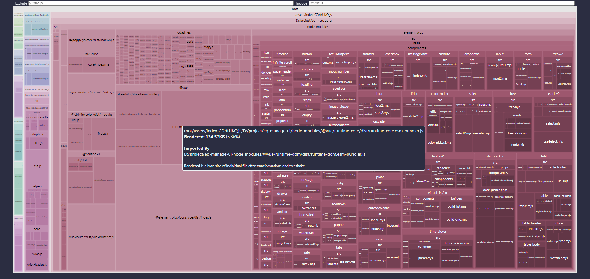
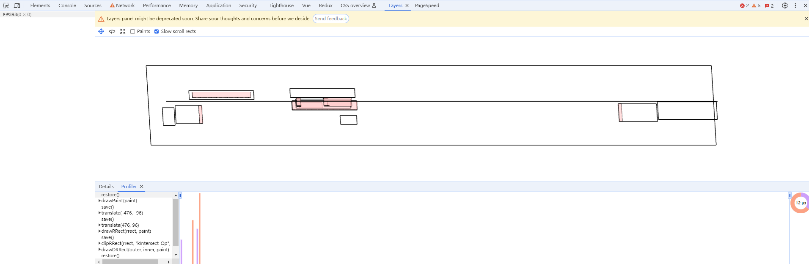

# 前端性能分析与优化

## 前言

### 性能优化

性能优化的目的，就是为了提供给用户更好的体验，这些体验包含这几个方面：展示更快、交互响应快、页面无卡顿情况。

更详细的说，就是指，在用户输入 url 到站点完整把整个页面展示出来的过程中，通过各种优化策略和方法，让页面加载更快；在用户使用过程中，让用户的操作响应更及时，有更好的用户体验

### 进程

进程（Process）是计算机中的程序关于某[数据集](https://baike.baidu.com/item/%E6%95%B0%E6%8D%AE%E9%9B%86/4745883?fromModule=lemma_inlink)合上的一次运行活动，是系统进行[资源分配](https://baike.baidu.com/item/%E8%B5%84%E6%BA%90%E5%88%86%E9%85%8D/2944359?fromModule=lemma_inlink)的[基本单位](https://baike.baidu.com/item/%E5%9F%BA%E6%9C%AC%E5%8D%95%E4%BD%8D/10189558?fromModule=lemma_inlink)，是操作系统结构的基础。在早期面向进程设计的计算机结构中，进程是程序的基本执行实体；在当代面向线程设计的计算机结构中，进程是线程的容器。程序是指令、数据及其组织形式的描述，进程是程序的实体 [进程（一段程序的执行过程）_百度百科](https://baike.baidu.com/item/%E8%BF%9B%E7%A8%8B/382503?fr=ge_ala)

一个进程可以有很多线程，每条线程并行执行不同的任务。

### 线程

线程（thread）是[操作系统](https://baike.baidu.com/item/%E6%93%8D%E4%BD%9C%E7%B3%BB%E7%BB%9F/192?fromModule=lemma_inlink)能够进行运算[调度](https://baike.baidu.com/item/%E8%B0%83%E5%BA%A6/0?fromModule=lemma_inlink)的最小单位。它被包含在[进程](https://baike.baidu.com/item/%E8%BF%9B%E7%A8%8B/382503?fromModule=lemma_inlink)之中，是[进程](https://baike.baidu.com/item/%E8%BF%9B%E7%A8%8B/0?fromModule=lemma_inlink)中的实际运作单位。一条线程指的是[进程](https://baike.baidu.com/item/%E8%BF%9B%E7%A8%8B/0?fromModule=lemma_inlink)中一个单一顺序的控制流，一个进程中可以并发多个线程，每条线程并行执行不同的任务。在Unix System V及[SunOS](https://baike.baidu.com/item/SunOS/0?fromModule=lemma_inlink)中也被称为轻量进程（lightweight processes），但轻量进程更多指内核线程（kernel thread），而把用户线程（user thread）称为线程。

一个进程可以有很多线程，每条线程并行执行不同的任务。

### 浏览器

1. GUI 渲染线程： 负责渲染浏览器页面，解析 HTML、CSS，构建 DOM 树、构建 CSSOM 树、构建渲染树和绘制页面；当界面需要重绘或由于某种操作引发回流时，该线程就会执行。<mark>注意：GUI 渲染线程和 JS 引擎线程是互斥的，当 JS 引擎执行时 GUI 线程会被挂起，GUI 更新会被保存在一个队列中等到 JS 引擎空闲时立即被执行。</mark>

2. JS 引擎线程： JS 引擎线程也称为 JS 内核，负责处理 Javascript 脚本程序，解析 Javascript 脚本，运行代码；JS 引擎线程一直等待着任务队列中任务的到来，然后加以处理，一个 Tab 页中无论什么时候都只有一个 JS 引擎线程在运行 JS 程序；注意：GUI 渲染线程与 JS 引擎线程的互斥关系，所以如果 JS 执行的时间过长，会造成页面的渲染不连贯，导致页面渲染加载阻塞，也就是卡顿。

3. 事件触发线程：事件触发线程属于浏览器而不是 JS 引擎，用来控制事件循环；当 JS 引擎执行代码块如 setTimeOut 时（也可是来自浏览器内核的其他线程，如鼠标点击、AJAX 异步请求等），会将对应任务添加到事件触发线程中；当对应的事件符合触发条件被触发时，该线程会把事件添加到待处理队列的队尾，等待 JS 引擎的处理；注意：由于 JS 的单线程关系，所以这些待处理队列中的事件都得排队等待 JS 引擎处理（当 JS 引擎空闲时才会去执行）；

4. 定时器触发线程： 定时器触发线程即 setInterval 与 setTimeout 所在线程；浏览器定时计数器并不是由 JS 引擎计数的，因为 JS 引擎是单线程的，如果处于阻塞线程状态就会影响记计时的准确性；因此使用单独线程来计时并触发定时器，计时完毕后，添加到事件队列中，等待 JS 引擎空闲后执行，所以定时器中的任务在设定的时间点不一定能够准时执行，定时器只是在指定时间点将任务添加到事件队列中；注意：W3C 在 HTML 标准中规定，定时器的定时时间不能小于 4ms，如果是小于 4ms，则默认为 4ms。

5. 异步 http 请求线程

### 解释语言与编译语言

解释型语言每次执行都需要把源码转换一次才能执行，而转换过程非常耗费时间和性能，也就导致在 JavaScript 背景下，web 无法执行一些高性能应用

### 同步/异步

**同步**：同步是指一个进程在执行某个请求的时候，如果该请求需要一段时间才能返回信息，那么这个进程会一直等待下去，直到收到返回信息才继续执行下去。

**异步**：异步是指进程不需要一直等待下去，而是继续执行下面的操作，不管其他进程的状态，当有信息返回的时候会通知进程进行处理，这样就可以提高执行的效率了，即异步是我们发出的一个请求，该请求会在后台自动发出并获取数据，然后对数据进行处理，在此过程中，我们可以继续做其他操作，不管它怎么发出请求，不关心它怎么处理数据。

### 事件循环机制

当JS解析执行时，会被引擎分为两类任务，同步任务（synchronous） 和 异步任务（asynchronous）。

对于同步任务来说，会被推到执行栈按顺序去执行这些任务。

对于异步任务来说，当其可以被执行时，会被放到一个 任务队列（task queue） 里等待JS引擎去执行。

当执行栈中的所有同步任务完成后，JS引擎才会去任务队列里查看是否有任务存在，并将任务放到执行栈中去执行，执行完了又会去任务队列里查看是否有已经可以执行的任务。这种循环检查的机制，就叫做事件循环(Event Loop)。

对于任务队列，其实是有更细的分类。其被分为 微任务（microtask）队列 & 宏任务（macrotask）队列

暂时无法在易控智驾文档外展示此内容

### node与brower循环机制差异

node10以下，与浏览器循环机制有差异

暂时无法在易控智驾文档外展示此内容

一直优先执行微任务，直到没有可执行的微任务才会开启下一次宏任务

### 宏任务

宏任务包括但不限于以下几种常见的任务：

1、定时器任务： 如setTimeout、setInterval

2、I/O任务：例如网络请求、文件读写等需要进行I/O操作的任务

3、用户交互任务：例如点击事件、输入事件等与用户交互的相关任务

4、渲染任务：当浏览器需要重绘或重新布局时触发的任务

5、请求动画帧任务：通过requestAnimationFrame()方法设置的任务，用于在每一帧进行绘画或动画操作

这些任务都是比较耗时的操作，在事件循环中被视为宏任务，需要等待一定时间或特定的触发条件才会执行

### 微任务

1、Promise回调：Promise对象的resolve或reject方法的回调函数

2、MutationObserver回调：当DOM发生变化时触发的回调函数

3、Promise的then()回调：Promise对象的then()方法中的回调函数

4、async/await函数中的后续操作：在async函数中使用await等待的操作完成后，紧接着的代码块中的任务

这些任务通常是较小且轻量级的操作，执行时间较短，适合在当前宏任务执行完毕后立即执行。由于微任务的执行时机在每个宏任务执行的过程中，因此可以保证在用户交互之前或渲染之前得到及时处理

### 垃圾回收机制

- 在JavaScript中，[垃圾回收](https://so.csdn.net/so/search?q=%E5%9E%83%E5%9C%BE%E5%9B%9E%E6%94%B6&spm=1001.2101.3001.7020)（Garbage Collection）是一种自动内存管理机制，它可以自动地识别不再使用的变量和对象并将它们从内存中清除，以释放内存空间。

- JavaScript中的[垃圾回收器](https://so.csdn.net/so/search?q=%E5%9E%83%E5%9C%BE%E5%9B%9E%E6%94%B6%E5%99%A8&spm=1001.2101.3001.7020)会定期扫描内存中的对象，标记那些可达对象和不可达对象。

  1. 可达对象指的是当前代码中正在被使用的对象

  2. 不可达对象指的是已经不再被引用的对象。

- 垃圾回收器会将不可达对象标记为垃圾对象，并将它们从内存中清除。

- JavaScript中的垃圾回收机制主要有两种：

  1. 标记清除（Mark-and-Sweep）和引用计数（Reference Counting）。

  2. 标记清除是JavaScript中主流的垃圾回收算法，而引用计数则已经很少被使用。

### 内存泄漏

内存泄漏（Memory Leak）是指程序中已动态分配的堆内存由于某种原因程序未释放或无法释放，造成系统内存的浪费，导致程序运行速度减慢甚至系统崩溃等严重后果。

### 闭包

暂时无法在易控智驾文档外展示此内容

闭包的作用就是在a执行完并返回后，闭包使得Javascript的垃圾回收机制不会收回a所占用的资源，因为a的内部函数b的执行需要依赖a中的变量。会造成垃圾回收机制无法正确回收使用完的资源，内存泄漏。

### 堆栈

堆的存储速度较慢，栈的存储速度较快，会自动释放

### js存储机制

JavaScript中变量类型有两种：

1. 基础类型（`Undefined, Null, Boolean, Number, String, Symbol(ES6新添加的)`）一共6种

2. 引用类型/复杂类型（`Object`)

基本数据类型：基本数据类型值指保存在栈内存中的简单数据段。访问方式是按值访问

引用类型：引用数据类型值指保存在堆内存中的对象。也就是，变量中保存的实际上的只是一个指针，这个指针指向内存中的另一个位置，该位置保存着对象。访问方式是按引用访问

也就是说：**一般来讲，简单类型存在栈中，复杂类型存在堆中**

### 从地址栏输入到显示页面

[全流程](https://zhuanlan.zhihu.com/p/409313471?utm_id=0)

1. **判断搜索词与url**：你在浏览器中输入信息时，浏览器就已经开始进行工作了。首先它会监听我们输入的信息并尝试匹配出你想要访问的网址或关键词，以 chrome 为例，它会猜我们想要什么，给出下面的建议项：

2. 使用默认搜索引擎搜索关键字

3. 书签，历史记录和最近下载中存储的其他链接

4. 使用默认搜索引擎的相关关键字搜索选项

    当我们在地址栏输入xxxx.com后**回车**，命令浏览器搜索信息。浏览器就会对输入的信息进行以下判断：

8. 输入的是不是一个合法的URI

    - 如果不是，就将输入的内容作为搜索的条件，生成一个**HTTP数据包**
    
    
    
    
    - 如果是，判断输入是否完整。浏览器可能会对域猜测，也就是说尝试通过在输入的内容中添加前缀、后缀或两者来 “补全” URL。比如输入 xxx.com 则可能会在前面添加 www。等有了一个URI之后，就**解析URI**。

2. **DNS解析：** 浏览器会从输入的URL中解析出域名，然后向DNS服务器发起域名解析请求，获取对应的IP地址。如果DNS缓存中存在该域名的IP地址，则直接返回给浏览器，否则就需要进行递归查询，最终得到该域名对应的IP地址。

3. **TCP连接：** 浏览器根据获取到的IP地址，发起TCP连接请求，通过三次握手建立起可靠的连接。这个过程中包括客户端发送连接请求报文，服务端发送连接确认报文，客户端再发送确认报文。

4. **HTTP请求：** 建立TCP连接后，浏览器会向服务器发送[HTTP请求报文](https://so.csdn.net/so/search?q=HTTP%E8%AF%B7%E6%B1%82%E6%8A%A5%E6%96%87&spm=1001.2101.3001.7020)，请求服务器返回对应的资源。其中请求 报文包括请求方法、URL、协议版本、请求头等信息。

5. **服务器响应：** 服务器收到请求后，会返回对应的响应报文，其中包括响应状态码、响应头以及响应内容等信息。浏览器会根据响应报文中的状态码来判断请求是否成功，并进行相应的处理。

6. **解析渲染：** 浏览器接收到响应内容后，会对HTML、CSS和JavaScript等进行解析，并将解析后的内容进行渲染，最终呈现在页面上。

7. **连接结束：** 页面展示完成后，浏览器会关闭TCP连接，释放资源，四次挥手。

### 三次握手与四次挥手（与优化无关）

#### 三次握手

**目的**：确认收发双方的通信/接收功能正常

1. 第一次握手，客户端发送到服务端，确定客户端发送功能，服务端接收功能正常，这次握手完成后

2. 服务端清楚：客户端发送正常，自己接收正常

    2. 服务端不清楚：客户端接收是否正常，自己的发送是否正常

    3. 客户端不清楚任何功能是否正常

2. 第二次握手，服务端发送到客户端，确定服务端发送功能，客户端接收功能正常，这次握手完成后

2. 服务端清楚：客户端发送正常，自己接收正常

    2. 服务端不清楚：客户端接收是否正常，自己发送是否正常

    3. 客户端清楚：自己发送正常，自己接收正常，服务端接收正常，服务端发送正常

3. 第三次握手，客户端发送到服务端，付服务端确定了双方功能都正常，可以正常通信

**举例子**：两个人打电话

1. 甲：喂，能听得到吗？（第一次握手，乙听到了证明乙听筒和甲话筒没问题）

2. 乙：能听到，你能听到吗？（第二次握手，甲听到了，知道乙听到自己的，证明甲听筒、话筒都没问题，乙听筒、话筒没问题，但是乙不知道甲能不能听到，不能继续沟通）

3. 甲：能听到，有个事跟你讲下？（第三次握手，双方都已经直到对方听筒，话筒没问题，可以沟通）

4. 甲乙开始沟通

#### 四次挥手

**目的**：确认双方数据发送完成，关闭连接

1. 第一次挥手：客户端发送到服务端：明确没有后续传输需求，需要关闭连接

2. 第二次挥手：服务端发送到客户端：表明已经收到关闭需求，执行关闭前准备任务

3. 第三次挥手：服务端完成后发送到客户端：服务端已经准备好了，可以关闭

4. 第四次挥手：客户端完成后发送到服务端：客户端关闭

### 页面渲染机制

1. **加载 HTML**: 首先，浏览器会获取 HTML 文件，并解析其结构。这个过程包括识别 HTML 标签、文本内容以及标签之间的关系。

2. **构建 DOM 树**: 解析 HTML 后，浏览器将构建 Document Object Model（DOM）树。DOM 树是一个对象表示网页的结构，其中每个 HTML 元素都是树中的一个节点，它们之间的关系由它们在 HTML 中的嵌套关系决定。

3. **加载 CSS**: 浏览器会加载并解析 CSS 文件，以确定每个 HTML 元素的样式。这个过程称为 CSS 解析和样式计算。浏览器将样式应用于 DOM 树中的相应元素，从而确定它们的外观。

4. **构建 CSSOM 树**: 类似于 DOM 树，浏览器还会构建 CSS Object Model（CSSOM）树，表示 CSS 的层次结构和规则。这个过程包括识别 CSS 规则和计算每个元素的最终样式。

5. **合并 DOM 和 CSSOM**: 浏览器将 DOM 树和 CSSOM 树合并成一个渲染树（Render Tree）。渲染树包含了需要在页面上显示的所有元素及其样式信息。

6. **布局（Layout）**: 浏览器根据渲染树中的每个元素的几何属性（如大小和位置）来确定它们在屏幕上的确切位置。这个过程称为布局或回流（Reflow）。

7. **绘制（Painting）**: 浏览器根据渲染树和布局信息将页面上的每个元素绘制到屏幕上。这个过程称为绘制或重绘（Repaint）。

8. **交互和事件处理**: 一旦页面被渲染，用户就可以与页面进行交互。浏览器会监听用户的事件，如鼠标点击、键盘输入等，并触发相应的事件处理程序（通常是 JavaScript 函数），以响应用户的操作。

### 回流/重绘

 **布局会不会变！ 回流一定会导致重绘，重绘不一定导致回流**

1. 重绘：简单来说就是重新绘画，当给一个元素更换颜色、更换背景，虽然不会影响页面布局，但是颜色或背景变了，就会重新渲染页面，这就是重绘。

2. 回流： 当增加或删除 dom 节点，或者给元素修改宽高时，会改变页面布局，那么就会重新构造 dom 树然后再次进行渲染，这就是回流。

**哪些会引起回流呢？**

- 改变 dom 元素的几何属性，常见的几何属性有 width、height、padding、margin、left、top、border 等等。

- 改变 dom 树的结构，主要指的是增加或减少 dom 节点，移动等操作。

- 获取一定特殊的属性值，如属性：offsetTop、offsetLeft、 offsetWidth、offsetHeight、scrollTop、scrollLeft、scrollWidth、scrollHeight、clientTop、clientLeft、clientWidth、clientHeight 时，你就要注意了！除此之外：调用了 getComputedStyle 方法，也会触发回流。

### 性能指标

|                             |                                                                                                                                                                                                                                                                                |
| --------------------------- | ------------------------------------------------------------------------------------------------------------------------------------------------------------------------------------------------------------------------------------------------------------------------------ |
| 指标                          | 指标解析                                                                                                                                                                                                                                                                           |
| Self Time                   | Self Time 代表函数本身执行消耗时间                                                                                                                                                                                                                                                         |
| Total Time                  | Total Time 则是函数本身消耗再加上在调用它的函数中消耗的总时间                                                                                                                                                                                                                                           |
| Activity                    | 浏览器活动的意思                                                                                                                                                                                                                                                                       |
| DOM GC                      | DOM 垃圾回收                                                                                                                                                                                                                                                                       |
| Timer Fried                 | 销毁计时器                                                                                                                                                                                                                                                                          |
| XMR Load                    | 异步加载对象加载                                                                                                                                                                                                                                                                       |
| Major GC                    | 清理年老区（Tenured space）                                                                                                                                                                                                                                                           |
| Minor GC                    | 每次 Minor GC 只会清理年轻代                                                                                                                                                                                                                                                            |
| Run Microtasks              | 运行微服务                                                                                                                                                                                                                                                                          |
| Recalculate Style           |                                                                                                                                                                                                                                                                             |
| HitTest                     | [https://www.jianshu.com/p/f6aff12fc08b](https://link.zhihu.com/?target=https%3A//www.jianshu.com/p/f6aff12fc08b)                                                                                                                                                              |
| DCLDomContentloaded         | 当 HTML 文档被完全加载和解析完成之后，DOMContentLoaded 事件被触发，无需等待样式表、图像和子框架的完成加载.                                                                                                                                                                                                              |
| SI (Speed Index)            | 指标用于显示页面可见部分的显示速度，单位是时间，                                                                                                                                                                                                                                                       |
| FPFirst Paint 首次绘制          | 首次绘制（FP）这个指标用于记录页面第一次绘制像素的时间，如显示页面背景色。FP 不包含默认背景绘制，但包含非默认的背景绘制。                                                                                                                                                                                                                |
| FCPFirst contentful paint   | 首次内容绘制 (FCP)： LCP 是指页面开始加载到最大文本块内容或图片显示在页面中的时间。如果 FP 及 FCP 两指标在 2 秒内完成的话我们的页面就算体验优秀。                                                                                                                                                                                           |
| LCPLargest contentful paint | 最大内容绘制 (LCP)： 用于记录视窗内最大的元素绘制的时间，该时间会随着页面渲染变化而变化，因为页面中的最大元素在渲染过程中可能会发生改变，另外该指标会在用户第一次交互后停止记录。官方推荐的时间区间，在 2.5 秒内表示体验优秀                                                                                                                                                           |
| FID（First input delay）      | 首次输入延迟，FID（First Input Delay），记录在 FCP 和 TTI 之间用户首次与页面交互时响应的延迟                                                                                                                                                                                                                  |
| TTITime to Interactive      | 可交互时间 (TTI) 首次可交互时间，TTI（Time to Interactive）。这个指标计算过程略微复杂，它需要满足以下几个条件：1、从 FCP 指标后开始计算 2、持续 5 秒内无长任务（执行时间超过 50 ms）且无两个以上正在进行中的 GET 请求往前回溯至 5 秒前的最后一个长任务结束的时间 3、对于用户交互（比如点击事件），推荐的响应时间是 100ms 以内。那么为了达成这个目标，推荐在空闲时间里执行任务不超过 50ms（ W3C 也有这样的标准规定），这样能在用户无感知的情况下响应用户的交互，否则就会造成延迟感。 |
| TBTTotal blocking Time      | 总阻塞时间 (TBT) 阻塞总时间，TBT（Total Blocking Time），记录在 FCP 到 TTI 之间所有长任务的阻塞时间总和。                                                                                                                                                                                                       |
| CLSCumulative Layout Shift  | 记录了页面上非预期的位移波动。页面渲染过程中突然插入一张巨大的图片或者说点击了某个按钮突然动态插入了一块内容等等相当影响用户体验的网站。这个指标就是为这种情况而生的，计算方式为：位移影响的面积 * 位移距离                                                                                                                                                                        |

### 核心指标

#### LCP

最大内容绘制 ， 代表了页面的速度指标，虽然还存在其他的一些体现速度的指标，但 LCP 能体现的东西更多一些。一是指标实时更新，数据更精确，二是代表着页面最大元素的渲染时间，通常来说页面中最大元素的快速载入能让用户感觉性能还挺好。

#### FID

首次输入延迟， 代表了页面的交互体验指标，就是看用户交互事件触发到页面响应中间耗时多少，如果其中有长任务发生的话那么势必会造成响应时间变长，推荐响应用户交互在 100ms 以内。

#### CLS

代表了页面的稳定指标，它能衡量页面是否排版稳定。尤其在手机上这个指标更为重要，因为手机屏幕挺小，CLS 值一大的话会让用户觉得页面体验做的很差。CLS 的分数在 0.1 或以下，则为 Good。

### 雅虎军规

1. Server：与页面发起请求的相关；

2. Cookie：与页面发起请求相关；

3. Mobile：与页面请求相关；

4. Content：与页面渲染相关；

5. Image：与页面渲染相关；

6. CSS：与页面渲染相关；

7. Javascript：与页面渲染和交互相关。

## 分析

### 工具

#### performance Api

##### 说明

##### 操作

1. 开启无痕模式，保证当前浏览器干净，避免插件等影响结果

2. 打开控制台（F12/右键检查/设置》开发者工具/control+shift+i），切换到 performance 标签

3. 点击录制（手动控制分析的操作过程）/刷新页面（自动记录页面加载性能，会自动停止）

4. 查看结果，分析各个部分占用比例

#### lighthouse

##### 模式说明

|          |                                                                      |                                                                   |
| -------- | -------------------------------------------------------------------- | ----------------------------------------------------------------- |
| 模式名称     | 说明                                                                   | 局限性                                                               |
| 导航模式（默认） | 获取性能分数和所有性能指标。 评估渐进式 Web 应用功能。 在页面加载后立即分析可访问性。                 | 无法分析表单提交或单页应用转换。 无法分析在页面加载时无法立即提供的内容。                          |
| 时间跨度模式   | 测量某个时间范围内的布局偏移和 JavaScript 执行时间，包括交互。 发现性能机会，以改善长期存在的页面和 SPA 的体验。 | 不提供总体性能分数。 无法分析基于时刻的性能指标（如：最大内容绘制）。 无法分析页面状态问题（如：没有无障碍功能类别） |
| 快照模式     | 分析当前状态的页面。 查找 SPA 或复杂表单深处的可访问性问题。 评估隐藏在交互后面的菜单和 UI 元素的最佳实践。    | 不提供总体性能分数或指标。 无法分析当前 DOM 之外的任何问题（如：没有网络、主线程或性能分析）。             |

##### 指标说明

|                                           |                                                                                                                                                                                                                 |
| ----------------------------------------- | --------------------------------------------------------------------------------------------------------------------------------------------------------------------------------------------------------------- |
| 主要监测指标                                    | 说明                                                                                                                                                                                                              |
| 性能指标（`Performance`）                       | 性能检测（重点）。对页面的性能评分，如：网页的加载速度、响时间等。 指标包括：首次内容绘制（First Contentful Paint）、首次有效绘制（First Meaningful Paint）、首次 CPU 空闲（First CPU Idle）、可交互时间（Time to Interactive）、速度指标（Speed Index）、输入延迟估值（Estimated Input Latency）。 |
| 可访问性（`Accessibility`）                     | 铺助检测。监测页面的可访问性与优化建议，如：网页的可访问性问题，HTML代码标签之类的优化等                                                                                                                                                                  |
| 最佳实践（`Best Practice`）                     | 实践性检测。如：网页安全性，如是否开启HTTPS、网页存在的漏洞等                                                                                                                                                                               |
| 搜索引擎优化（`SEO: Search Engine Optimisation`） | 搜索引擎优化检测。如：网页title是否符合搜索引擎的优化标准等                                                                                                                                                                                |
| PWA（`Progressive Web App`）                | 验证 PWA 的各个方面的性能情况。                                                                                                                                                                                              |

##### 操作

1. 开启无痕模式，保证当前浏览器干净，避免插件等影响结果

2. 打开控制台（F12/右键检查/设置》开发者工具/control+shift+i），切换到 lighthouse标签

3. 配置需要检测的配置

4. 点击右上角按钮

#### performance monitor

##### 说明

- CPU usage, CPU占用率

- JS head size, JS内存使用大小

- DOM Nodes, 内存中挂载的DOM节点个数

- JS event listeners, 事件监听数

- Document

- Document Frames

- Layouts / sec, 布局重排, 浏览器用来计算页面上所有元素的位置和大小的过程

- Style recalcs / sec, 页面样式重绘

##### 操作

1. 开启无痕模式，保证当前浏览器干净，避免插件等影响结果

2. 打开控制台（F12/右键检查/设置》开发者工具/control+shift+i），切换到 performace monitor标签

3. 配置需要检测的配置

#### memory

##### 说明

- **Constructor 列**表示使用此构造函数创建的对象，例如 Array x18226 表示使用Array构造器创建的对象有18226个。

- **Distance 列**表示对象最短简单路径到GC根节点的距离。

- **Shallow Size 列**显示了由特定构造函数创建的所有对象的浅层大小总和。浅层大小是对象本身占用的内存大小，典型的 JavaScript 对象会预留一些内存用于说明和存储值。通常，只有数组和字符串具有明显的浅层大小。不过，字符串和外部数组的主存储空间通常位于渲染器内存中，只在 JavaScript 堆上公开一个小的封装容器对象。

- **Retained Size列**显示同一组对象中的最大保留大小。这是对象本身以及无法再从**根**访问的依赖对象后被释放的内存大小。

##### 操作

- 开启无痕模式，保证当前浏览器干净，避免插件等影响结果

- 打开控制台（F12/右键检查/设置》开发者工具/control+shift+i），切换到 memory 标签

- 点击左上角录制按钮

#### vue-devtools

##### 说明

1. mouse：鼠标事件执行顺序

2. keyboard：键盘事件顺序

3. component：组件事件顺序

4. performance：性能监控

##### 操作

- 前往chrome devtools安装插件

- 开启无痕模式，保证当前浏览器干净，避免插件等影响结果

- 打开控制台（F12/右键检查/设置》开发者工具/control+shift+i），切换到 vue 标签

- 点击timeline标签

- 点击右上角图层标签配置需要监控的项目

- 执行操作

- 分析结果

#### inspect

##### 说明

inspect功能比较全面，包含文件编译对比，文件引用关系图，编译与加载时间分析等

##### 操作

1. 安装 vite-plugin-inspect 依赖

暂时无法在易控智驾文档外展示此内容

2. 重启项目

3. 访问inspect地址 http://localhost:8686/__inspect/

#### Rollup Plugin Visualizer

##### 说明

用于分析和可视化Rollup打包后的文件的插件

##### 操作

1. 安装依赖

  暂时无法在易控智驾文档外展示此内容

2. 打包项目

  暂时无法在易控智驾文档外展示此内容

3. 项目目录下生成stats.html文件，打开即可

#### coverage

##### 说明

分析css/js的代码覆盖率

##### 操作

- 开启无痕模式，保证当前浏览器干净，避免插件等影响结果

- 打开控制台（F12/右键检查/设置》开发者工具/control+shift+i），切换到 coverage标签

- 点击左上角录制按钮

- 清理没用到的文件

#### layers

##### 说明

分析页面dom的层级以及滚动元素的分布

##### 操作

- 开启无痕模式，保证当前浏览器干净，避免插件等影响结果

- 打开控制台（F12/右键检查/设置》开发者工具/control+shift+i），切换到 layers 标签

- 按需配置即可

#### PageSpeed Insight

https://pagespeed.web.dev/

[file](./files/pageSpeedLisights.crx)

## 优化

### 开发阶段

#### html

##### 减少 dom 数量与嵌套层级

HTML 中标签元素越多，标签的层级越深，浏览器解析 DOM 并制作到浏览器中所花的时间就越长，所以应尽或许坚持 DOM 元素简洁和扁平化的层级

##### 使用语义化标签

1. 易于用户阅读，样式丢失的时候能让页面呈现清晰的结构。

2. 有利于SEO，搜索引擎根据标签来确定上下文和各个关键字的权重。

3. 方便其他设备解析，如盲人阅读器根据语义渲染网页

4. 有利于开发和维护，语义化更具可读性，代码更好维护，与CSS3关系更和谐。

##### 删除不必要属性和标签

没用的代码应在网站或应用程序中删除，因为它们会使网页体积增

##### 尽量不用iframe

尽量少用iframe标签，爬虫是不会读取iframe的内容的，而且iframe会阻断流程

#### js

##### 减少数据操作

主要体现在代码逻辑、数据结构、算法上面，场景比较多，具体情况具体分析，下面是两个例子

暂时无法在易控智驾文档外展示此内容

暂时无法在易控智驾文档外展示此内容

暂时无法在易控智驾文档外展示此内容

##### 减少dom操作

DOM操作涉及到页面的重绘和重排，而这些过程是相对昂贵的。因此，优化DOM操作是提高网页性能的关键

1. 将多个DOM操作合并为一个批量操作，以减少重排的次数

2. 避免在循环中重复使用昂贵的[DOM选择器](https://so.csdn.net/so/search?q=DOM%E9%80%89%E6%8B%A9%E5%99%A8&spm=1001.2101.3001.7020)，将选择器的结果缓存起来以提高性能

3. 在进行多次DOM操作时，避免在每次操作前都查询DOM元素的计算值。将计算值缓存起来，以减少浏览器的计算开销

4. 当需要重复插入相似的DOM结构时，可以考虑使用文档碎片或克隆节点的方式，减少重排次数

##### 清理console

打印也是需要消耗性能的，尤其是打印较大的数据，线上环境应该仅打印最关键的一些异常和错误捕获

##### 异常捕获

对于不确定的逻辑进行异常捕获，防止因为报错引发的页面崩溃等一系列问题

暂时无法在易控智驾文档外展示此内容

##### 内存泄漏

1. 循环引用

2. 定时器没清理

3. dom没正确删除

4. 事件没有清除

5. 闭包过度使用

6. 全局变量未清除

7. 大数据引用未及时清除

使用memory工具检查内存泄漏问题

##### 节流与防抖

可以降低处理数据的频率

##### WebAssembly

W3C WebAssembly Community Group 开发的一项网络标准，对于浏览器而言，WebAssembly 提供了一条途径，让各种语言编写的代码以接近原生的速度在 Web 中运行。在这种情况下，以前无法以此方式运行的客户端软件等都将可以运行在 Web 中

##### 缓存

pwa/worker/storage/indexdb

缓存需要及时清理

##### 递归

谨慎使用递归，部分场景可以通过迭代来替代

暂时无法在易控智驾文档外展示此内容

可以看到，迭代相对递归来讲，内存占用较少，但是耗时较长，最终适用方案需要按照实际情况考虑

##### 深拷贝与浅拷贝

1. 浅拷贝： 将原对象或原数组的引用直接赋给新对象，新数组，新对象／数组只是原对象的一个引用

2. 深拷贝： 创建一个新的对象和数组，将原对象的各项属性的“值”（数组的所有元素）拷贝过来，是“值”而不是“引用”

这个和上边提到的js存储机制有关，深拷贝对于大数据量来说会增加很大的内存负担

##### worker

Web Worker 是一项 HTML5 新特性，可以在 Web 页面中创建后台线程，从而可以让 JavaScript 在主线程运行的同时，在后台线程中执行耗时的操作。这使得 Web 应用程序可以更加流畅，而不会出现 UI 卡顿或其他性能问题。

主要用来处理一下需要高频、高额开销的逻辑处理，主要用在音视频处理，语音生成解析，游戏逻辑计算等场景

##### 原生方法

无论你的 JavaScript 代码如何优化，都比不上原生方法。因为原生方法是用低级语言写的（C/C++），并且被编译成机器码，成为浏览器的一部分。当原生方法可用时，尽量使用它们，特别是数学运算和 DOM 操作。

##### 事件委托

减少观测dom数量

暂时无法在易控智驾文档外展示此内容

##### 虚拟列表

在传统的列表渲染中，如果列表数据过多，一次性渲染所有数据将耗费大量的时间和内存。当我们上下滚动时，性能低的浏览器或电脑都会感觉到非常的卡，这对用户的体验时是致命的。于是我们会想到**懒加载**，当资源到达可视窗口内时，继续向服务器发送请求获取接下来的资源，不过当获取的资源越来越多时，此时浏览器不断重绘与重排，同时dom数量也越来越多，这样的开销也是要考虑的当数量多到一定程度时，页面也会出现卡顿，考虑实际渲染的只有部分内容，大多数内容是不需要渲染的，因此采用一定的计算方式来减少dom的使用。

##### 合理处理ajax请求

1. 对于一些不会变动的数据接口，请求后进行持久化到本地

2. 一些可以合并的接口进行合并

3. 去除没必要的数据传输

##### js放到页面底部

脚本的下载和执行，会阻塞其他资源（样式文件或图片）的下载。因此，将<script>标签尽量尽可能放到<body>标签的底部。

#### css

##### 减少回流与重绘

###### CSS

1. 避免使用table布局。

2. 尽可能在DOM树的最末端改变class。

3. 避免设置多层内联样式。

4. 将动画效果应用到position属性为absolute或fixed的元素上。

5. 尽量减少使用CSS表达式（例如：calc()）。

###### JavaScript

1. 避免频繁操作样式，最好一次性重写style属性，或者将样式列表定义为class并一次性更改class属性。

2. 避免频繁操作DOM，创建一个documentFragment，在它上面应用所有DOM操作，最后再把它添加到文档中。

3. 也可以先为元素设置display: none，操作结束后再把它显示出来。因为在display属性为none的元素上进行的DOM操作不会引发回流和重绘。

4. 避免频繁读取会引发回流/重绘的属性，如果确实需要多次使用，就用一个变量缓存起来。

5. 对具有复杂动画的元素使用绝对定位，使它脱离文档流，否则会引起父元素及后续元素频繁回流。

##### gpu渲染加速

上边回流与重绘，在渲染中主要消耗时间的是Layout/Reflow和Paint/Repaint的过程，因此要尽量避免和减少这两个阶段的时间。

如何开启硬件加速

1. transform

2. opacity

3. filter

4. will-change: left; 浏览器就会知道left这个属性会发生变化，因此会开启硬件加速优化性能

##### important

尽量不要使用，破坏了样式表中固有的级联规则，使调试bug变得更加困难

##### id选择器不需要嵌套

权重最大，而且全局唯一，不需要嵌套，只会增加性能消耗

##### 动画

尽量减少js动画，使用canvas或者css,使用requestAnimationFrame来进行渲染

##### 使用字体图片替代图片

字体的大小比图片要小很多

##### 雪碧图

雪碧图的作用就是减少请求数，而且多张图片合在一起后的体积会少于多张图片的体积总和，这也是比较通用的图片压缩方案

##### 降低图片质量

这个需要和设计协商，一般项目用不到太高清的图片，只会增加流量消耗，降低加载效率

##### 图片懒加载

图片基本是最占用资源的东西了，尽量减少使用，按需加载，这个需要和响应效率做平衡

##### 使用css替代图片/视频效果

有很多图片使用 CSS 效果（渐变、阴影等）就能画出来，这种情况选择 CSS3 效果更好。因为代码大小通常是图片大小的几分之一甚至几十分之一

##### webp

WebP是一种同时提供了[有损压缩](https://baike.baidu.com/item/%E6%9C%89%E6%8D%9F%E5%8E%8B%E7%BC%A9/2311513?fromModule=lemma_inlink)与[无损压缩](https://baike.baidu.com/item/%E6%97%A0%E6%8D%9F%E5%8E%8B%E7%BC%A9/2817566?fromModule=lemma_inlink)（可逆压缩）的[图片文件格式](https://baike.baidu.com/item/%E5%9B%BE%E7%89%87%E6%96%87%E4%BB%B6%E6%A0%BC%E5%BC%8F/1989798?fromModule=lemma_inlink)，派生自影像编码格式[VP8](https://baike.baidu.com/item/VP8/8983934?fromModule=lemma_inlink)，被认为是[WebM](https://baike.baidu.com/item/WebM/2455966?fromModule=lemma_inlink)多媒体格式的姊妹项目，是由[Google](https://baike.baidu.com/item/Google/86964?fromModule=lemma_inlink)在购买[On2 Technologies](https://baike.baidu.com/item/On2%20Technologies/3745812?fromModule=lemma_inlink)后发展出来，以[BSD](https://baike.baidu.com/item/BSD/3794498?fromModule=lemma_inlink)[授权条款](https://baike.baidu.com/item/%E6%8E%88%E6%9D%83%E6%9D%A1%E6%AC%BE/2797008?fromModule=lemma_inlink)发布，在压缩方面比当前[JPEG格式](https://baike.baidu.com/item/JPEG%E6%A0%BC%E5%BC%8F/3462770?fromModule=lemma_inlink)更优越。

##### 降低 css 选择器复杂性

1. 减少嵌套。后代选择器的开销是最高的，因此我们应该尽量将选择器的深度降到最低（最高不要超过三层），尽可能使用类来关联每一个标签元素

2. 关注可以通过继承实现的属性，避免重复匹配重复定义

3. 尽量使用高优先级的选择器，例如 ID 和类选择器。

4. 避免使用通配符，只对需要用到的元素进行选择

##### 使用flex

在早期的 CSS 布局方式中我们能对元素实行绝对定位、相对定位或浮动定位。而现在，我们有了新的布局方式 flexbox，它比起早期的布局方式性能更好。

##### 谨慎使用*、p通配符

尽量减少使用这种会造成大规模匹配的选择器

##### 删除不必要的单位和0

减少代码量，一两条可能没效果，大型项目影响就比较严重

暂时无法在易控智驾文档外展示此内容

##### 谨慎使用base64

将图片的内容以Base64格式内嵌到HTML中，可以减少HTTP请求数量。但是，由于Base64编码用8位字符表示信息中的6个位，所以编码后大小大约比原始值扩大了 33%。

#### vue

首先明确vue也只是js的封装，所有适用于js的优化都适用于vue，在这个基础上针对Vue的优化如下

##### 选择渲染架构

如果你的用例对页面加载性能很敏感，请避免将其部署为纯客户端的 SPA，而是让服务器直接发送包含用户想要查看的内容的 HTML 代码。纯客户端渲染存在首屏加载缓慢的问题，这可以通过[服务器端渲染 (SSR)](https://cn.vuejs.org/guide/extras/ways-of-using-vue.html#fullstack-ssr) 或[静态站点生成 (SSG)](https://cn.vuejs.org/guide/extras/ways-of-using-vue.html#jamstack-ssg) 来缓解

##### 选择正确的版本

根据需要vue的不同特性，选择不同的发布版本来使用，如果你只在渐进式增强的场景下使用 Vue，并想要避免使用构建步骤，请考虑使用 [petite-vue](https://github.com/vuejs/petite-vue) (只有 **6kb**) 来代替

##### props稳定性

在 Vue 之中，一个子组件只会在其至少一个 props 改变时才会更新,应该尽量保证props的围挡

暂时无法在易控智驾文档外展示此内容

##### v-once/v-memo

对于不需要更新和可以认为控制的大消耗组件，进行针对性的优化

##### shallowRef/shallowReactive

Vue 的响应性系统默认是深度的。虽然这让状态管理变得更直观，但在数据量巨大时，深度响应性也会导致不小的性能负担，因为每个属性访问都将触发代理的依赖追踪，通过这两个方法可以将响应式调整为浅层监听

##### 减少不必要的组件

[性能优化 | Vue.js](https://cn.vuejs.org/guide/best-practices/performance.html#avoid-unnecessary-component-abstractions)

组件实例比普通 DOM 节点要昂贵得多，而且为了逻辑抽象创建太多组件实例将会导致性能损失

##### 合理使用 v-if 和 v-show

**v-if** 是 **真正** 的条件渲染，因为它会确保在切换过程中条件块内的事件监听器和子组件适当地被销毁和重建；也是**惰性的**：如果在初始渲染时条件为假，则什么也不做——直到条件第一次变为真时，才会开始渲染条件块。

**v-show** 就简单得多， 不管初始条件是什么，元素总是会被渲染，并且只是简单地基于 CSS 的 display 属性进行切换。

所以，v-if 适用于在运行时很少改变条件，不需要频繁切换条件的场景；v-show 则适用于需要非常频繁切换条件的场景。

##### 合理使用 watch和 computed

**computed：** 是计算属性，依赖其它属性值，并且 computed 的值有缓存，只有它依赖的属性值发生改变，下一次获取 computed 的值时才会重新计算 computed 的值；

**watch：** 更多的是「观察」的作用，类似于某些数据的监听回调 ，每当监听的数据变化时都会执行回调进行后续操作；

**computed：** 3.4 优化了更新逻辑，仅在值改变才会触发，而不是依赖发生改变就出发，多用

**运用场景：**

- 当我们需要进行数值计算，并且依赖于其它数据时，应该使用 computed，因为可以利用 computed 的缓存特性，避免每次获取值时，都要重新计算；

- 当我们需要在数据变化时执行**异步**或**开销较大**的操作时，应该使用 watch，使用 watch 选项允许我们执行异步操作 ( 访问一个 API )，限制我们执行该操作的频率，并在我们得到最终结果前，设置中间状态。这些都是计算属性无法做到的。

##### v-for/key

在没有 key 的情况下，Vue 将使用一种最小化元素移动的算法，并尽可能地就地更新/复用相同类型的元素。如果传了 key，则将根据 key 的变化顺序来重新排列元素，并且将始终移除/销毁 key 已经不存在的元素，具体是不是要使用根据实际情况

##### keep-alive

不要滥用，keep-alive对性能的消耗非常大，要识别清楚那些页面是真有需求使用的

##### 定义响应式数据

一些不需要响应式的数据不要进行转化，比如echarts实例等

##### 销毁事件

用不到的事件及时销毁，同js内存泄漏

##### 路由懒加载

当打包构建应用时，JavaScript 包会变得非常大，影响页面加载。如果我们能把不同路由对应的组件分割成不同的代码块，然后当路由被访问的时候才加载对应组件，这样就会更加高效。

##### 按需引入

可以减少最终生成代码体积

##### 非单一组件内不要使用id

id只能在页面内唯一，如果不唯一会引发一些bug，比如选择器无法正确选择

##### 熟悉dom更新机制

要熟悉dom的更新，哪些情况会触发更新，避免无效触发更新，降低更新消耗

##### 减少包的引用

有很多包里边的大多数方法都用不到，可能因为一两个方法就引入，包本身也不一定支持tree-shaking，就会导致很多额外的代码最终打包到生产环境，这里可以选择

1. 找一个功能更单一的替代包

2. 自己手写或者从包的源码中找到对应的代码复制到工程中

#### 构建

##### 代码压缩

减少代码体积terser

##### 代码混淆

减少代码体积terser

##### 注释清理

减少代码体积roolup

##### tree-shaking

减少代码体积`unplugin-vue-components` 和 `unplugin-auto-import`

##### 分包

减少代码体积roolup

##### cdn

常用文件可以通过cdn引入,多个项目之间缓存，避免重复下载

### 传输阶段

#### 协议（运维处理，了解即可）

##### dns

1. 使用靠谱的dns服务器

2. 缓存 DNS 记录

3. 减少查找次数

4. 设置合理的cnd

5. 设置合理的ttl

6. dns预解析

##### cdn

1. 内容分发网络（CDN）是一组分布在多个不同地理位置的 Web 服务器。我们都知道，当服务器离用户越远时，延迟越高。CDN 就是为了解决这一问题，在多个位置部署服务器，让用户离服务器更近，从而缩短请求时间

##### http

1. 最小化请求大小

2. 减少重定向

3. 最小化响应大小

4. 移除不必要的字段，压缩不必要的数据，对于可转化的大型数据进行转化

##### 缓存

#### 服务器

##### gzip

GZIP最早由Jean-loup Gailly和[Mark Adler](https://baike.baidu.com/item/Mark%20Adler/0?fromModule=lemma_inlink)创建，用于[UNⅨ](https://baike.baidu.com/item/UN%E2%85%A8/0?fromModule=lemma_inlink)系统的[文件压缩](https://baike.baidu.com/item/%E6%96%87%E4%BB%B6%E5%8E%8B%E7%BC%A9/0?fromModule=lemma_inlink)。我们在[Linux](https://baike.baidu.com/item/Linux/0?fromModule=lemma_inlink)中经常会用到后缀为.gz的文件，它们就是GZIP格式的。现今已经成为Internet 上使用非常普遍的一种[数据压缩](https://baike.baidu.com/item/%E6%95%B0%E6%8D%AE%E5%8E%8B%E7%BC%A9/0?fromModule=lemma_inlink)格式，或者说一种文件格式。

可以大幅减少文件大小

### 其它

#### loading

虽然没实际提升效率，但是给用户心理上一种期望，让用户知道系统已经响应的用户操作，不是卡死了

#### 骨架屏

在需要等待加载内容的位置设置一个骨架屏，某些场景下比 Loading 的视觉效果更好，比如一些表单页

#### 性能收集

1. 通过 performance 对象传递数据给性能收集服务器

2. 监听异常事件给异常分析服务器

#### 懒加载

牺牲部分后期的体验，提升首屏加载效率

#### 上划/下拉加载

同上

## 最后

### 大数据图表处理

1. 考虑到大部分情况下需要展示的只是指定区间段的数据，并不需要展示所有数据，通过滑动窗口 + 缓存算法过滤第一次数据量

2. 由于过滤后仍然存在数据较大的情况，理论上屏幕最多可展示数据量为 图表宽度的物理像素量，超出的数据量已经无法展示，因此可以通过降采样算法来进一步过滤数据，常用的采样规则有如下几种

2. a)取区间段最大值

    2. b)取区间段最小值

    3. c)取区间段平均值

    4. d)取区间段总和

    5. e)设定阈值，超过阈值波动的所有值采用一定策略最大程度保留 其中效果最好的应该为 e,但是也是耗费性能最多的，根据开发实际情况测试最终执行方案

3. 考虑到会展示同时展示多个图表，最终高度会超过一屏的展示上限，所以对于超出视口的图表采用虚拟列表优化方案，保留当前视口上下界外 50% 的余量，其余图表进行隐藏，减少计算量，等合适的时候再进行预加载

4. 考虑到操作频率，用户可能会高频拖动里程展示条，高频刷新数据，对全后端性能造成较大影响，用户操作事件上采用防抖/节流算法，通过事件队列去除重复项，在保证用户体验的同时尽可能减少对于数据刷新造成的资源浪费

5. 考虑到数据计算，由于数据量较大对客户端和服务端的性能影响较大，js本身是单线程运行，大量数据运算可能会造成阻塞，影响用户体验，因此采用 web worker 进行数据处理，通过 worker 线程进行较大数据量的运算，保证主线程的流畅性

6. 考虑到事件绑定，由于图表数量较多，可以考虑采用事件委托机制，通过对于父级组件的事件监听来统一接受，处理图表响应事件，包括拖动，点击等

7. 考虑到多组件数据传递、通过订阅发布模式，对列循环处理，优先保证在视口范围内的组件实时刷新，视口范围外的组件延迟刷新，尽量提升用户体验

8. 考虑到数据加工，采用工厂模式统一处理图表数据，统一优化数据处理算法与效率。

9. 对较长的重复数据进行编码，前端收到后再解析，节省空间

  暂时无法在易控智驾文档外展示此内容

10. 考虑到数据传输，结合上述算法，采用分段加载数据的方式，优先加载视口内，可展示部分数据，再通过反向推导的方式加载全部数据，缓存到内存中备用

11. 追加数据增量更新,较少需要传输的数据量

12. 数据传输采用二进制传输,减少数据量

13. 增加绘制缓存区域,拿过来直接用

14. 批量调用接口获取数据/通过 socket 流传输数据分批加载

15. 数据采用 indexDB 缓存,防止 localstorage 过大无法存储的问题

### 如何取舍

#### 时间与空间交换

依据项目属性和针对用户决定，大部分用户设备性能更高，采用空间换时间，性能更差，采用时间换空间

#### 易维护性和效率

看项目需求决定，效率是否影响最终用户体验，不影响的情况华以可读性和易维护性优先

#### 时间成本与项目进度

以项目进度优先，拿到结果的前提下才能考虑优化问题

#### 产出成果与付出成本

以团队主导人的情况优先，不同团队对于优化的重视程度不同